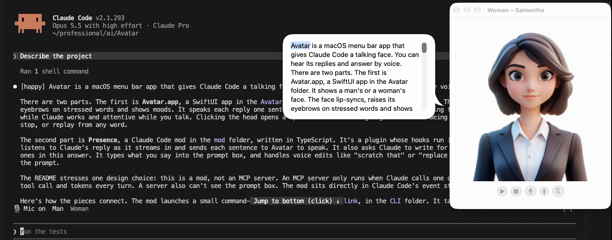
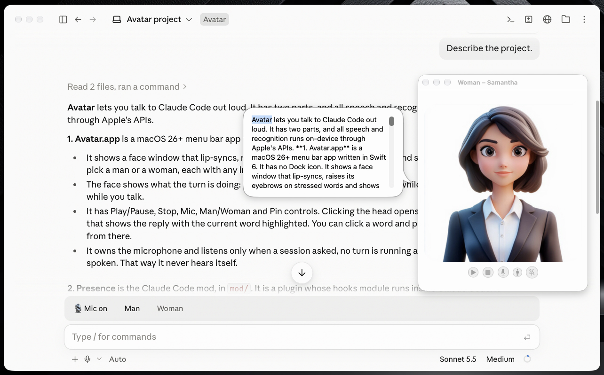

# Avatar

Talk with Claude Code out loud. **Avatar** is a macOS menu bar app with a face that speaks and
listens; **Presence**, its Claude Code mod (in [`mod/`](mod/)), connects it to your Claude Code
session.

## Claude code



## Claude Desktop



- **Replies spoken as they are written**, one sentence at a time, by a face that lip-syncs, raises its
  eyebrows on stressed words and shows moods. A man and a woman, each with any installed English voice
  of their gender.
- **The face follows the turn:** thinking while Claude works,
  speaking while it answers, listening while you talk: small nods as your words come in, brows up
  and fewer blinks while you speak, a brief glance when you pause, and a nod when you finish.
- **Your voice into Claude Code's prompt box:** with the mic on, between turns, what you say is typed
  into the prompt, where you can edit it with the keyboard or by voice ("scratch that", "clear"); say
  **"send it"** on its own to send it. A line above the prompt shows what is being heard.
- **Avatar's window:** the face, and below it **Play/Pause** (Space), **Stop**, **Mic**, **Man/Woman**
  and **Pin**. Click the head to show the **speech bubble**: the reply, the word being said highlighted.
- **Play from anywhere:** once stopped or paused, the bubble has a caret, left on the word that was being
  said. Click a word or move the caret with the keys, then Play (or Space or Return in the bubble) says
  the reply from that word on. A reply said to its end puts the caret back at the top. After Stop, what
  Claude writes next in that reply joins the bubble unsaid until you press Play.
- Everything is on-device: Apple's speech synthesis and speech recognition.

## Built as a Claude Code mod, not an MCP server

> **Presence is a Claude Code mod**: a plugin whose hooks module runs inside Claude Code itself.
> **Avatar uses no MCP server** and adds no tools for Claude to call.

An MCP server can only act when Claude decides to call one of its tools. To be spoken, a reply would
have to be sent to a tool after it was written, costing a tool call and tokens every turn, and the
server could never see the prompt box. A mod sits in Claude Code's own event stream instead. The
hooks Presence uses:

- `turn.step`: the reply as it streams, so each sentence is spoken while Claude writes the next.
- `turn.start`, `turn.complete`: the face's thinking and idle states, and when the mic may listen.
- `prompt.compose`: asks Claude to write for the ear, with mood cues such as `[happy]`.
- `$.prompt.read`, `fill`, `submit`: your voice into the prompt box, voice edits, and "send it".
- `ui.render` on `AbovePrompt`, `$.ui.toast`, `command.register`: the band above the prompt, toasts
  and `/presence`.

See [How it works](#how-it-works) for how the mod reaches Avatar.

## Install

Requires macOS 26 (Tahoe) or later, on an Apple silicon or Intel Mac, and Claude Code with mod
(plugin hooks module) support; tested with Claude Code 2.1.293. Avatar must live in `/Applications`:
that is where the mod looks for it.

### Download (no developer tools needed)

1. Download `Avatar-<version>.zip` from the [latest release](https://github.com/sandipchitale/Avatar/releases/latest),
   unzip it, and move **Avatar.app** to your Applications folder (replacing an earlier version).
2. Avatar isn't notarized by Apple, so macOS blocks it the first time. To allow it, run this once:
   ```sh
   xattr -dr com.apple.quarantine /Applications/Avatar.app
   ```
   Or, without Terminal: try to open Avatar, then go to System Settings → Privacy & Security, scroll
   down, and click **Open Anyway**.
3. Open Avatar. Its face appears in a window and its icon in the menu bar.
4. Install the mod, as in [Load the Presence mod](#load-the-presence-mod) below.

### Build from source

You need:

- **Xcode 26 or later** (from the App Store; open it once to finish its setup). The command-line tools
  alone are not enough, as Avatar has an asset catalog and a test bundle.
- **[XcodeGen](https://github.com/yonaskolb/XcodeGen)**, which writes the Xcode project from
  `project.yml` (the project itself isn't in the repository): `brew install xcodegen`.

Then:

```sh
git clone https://github.com/sandipchitale/Avatar.git
cd Avatar
xcodegen generate
xcodebuild -project Avatar.xcodeproj -scheme Avatar -configuration Release \
  -destination 'generic/platform=macOS' -derivedDataPath build build
rm -rf /Applications/Avatar.app        # if an earlier version is installed
cp -R build/Build/Products/Release/Avatar.app /Applications/
open /Applications/Avatar.app
```

The build is signed ad hoc (no Apple developer account needed), and an app built on your own Mac
isn't blocked by Gatekeeper. Each rebuild is a new signature to macOS, so after replacing the app it
may ask again for Microphone and Speech Recognition access; if the mic stays silent, turn Avatar
off and on again under System Settings → Privacy & Security → Microphone and → Speech Recognition.

To run the tests: `xcodebuild -project Avatar.xcodeproj -scheme Avatar test` for the app, and
`claude plugin test mod` for the mod. To work on it in Xcode, `open Avatar.xcodeproj` after
`xcodegen generate`, and run `xcodegen generate` again whenever you add or remove files.

### Load the Presence mod

In Claude Code, add this repository as a plugin marketplace and install the mod:

```
/plugin marketplace add sandipchitale/Avatar
/plugin install presence@presence
```

Or, from a clone, load it for one session: `claude --plugin-dir /path/to/Avatar/mod`.

Replies are spoken as soon as Avatar is running. The first time you turn the mic on (Avatar's Mic
button, or `/presence mic on`), allow Avatar's Microphone and Speech Recognition access.

Presence works in a terminal and in the Claude desktop app's Code tab (a local session; installed as
above, at the user scope), where what you say goes into the desktop's own prompt box the same way.
The desktop app starts its session with your first prompt; that first reply is spoken too, once
Avatar attaches. Headless runs (`claude -p`, the Agent SDK) are never spoken.

## Using it

| | |
|---|---|
| `/presence mic on` / `off` | Listening between turns, into the prompt box (or the 🎙 button above the prompt, or Avatar's Mic button) |
| `/presence face male` / `female` | Which face speaks (or the Man / Woman buttons above the prompt, or Avatar's Man/Woman button or menu) |
| `/presence stop` | Silence (or Avatar's Stop; replies resume with the next turn) |
| `/presence replay` | The last reply again, from the top (or Play with the caret at the top) |
| `/presence on` / `off` | Speak replies in this session or not |
| `/presence status` | What is attached, spoken and listening |

**Voice commands**, each said on its own (the same words inside a longer phrase are typed as words).
Edits work on the prompt box's text, at its end or on the last place a phrase occurs; click and type
for anything finer.

| Say | Does |
|---|---|
| "send it" · "send prompt" | Sends the prompt box |
| "scratch that" · "delete that" | Removes the last phrase you said |
| "clear" · "delete all" | Empties the prompt box |
| "undo that" · "redo that" | Undoes or redoes the last voice change |
| "replace *X* with *Y*" | Replaces the last *X* |
| "insert *X* before / after *Y*" | Inserts *X* next to the last *Y* |
| "delete *X*" | Removes the last *X* |
| "delete (last) word" · "delete last *3* words" | Also characters, sentences and lines |
| "capitalize / uppercase / lowercase *X*" | Changes the last *X* |
| "new line" · "new paragraph" · "insert date" | Adds them at the end |
| "type *X*" | Adds *X* exactly as said, never as a command |
| "stop" · "say that again" · "mic off" | Stops speaking, replays the last reply, turns the mic off |

Avatar's menu: Show Avatar, Face (Man / Woman), Man's Voice, Woman's Voice, Quit. Better voices:
System Settings → Accessibility → Read & Speak → ⓘ → English → Voice (Enhanced and Premium voices).

## How it works

```
Claude Code ── Presence mod ── spawns  avatar-link attach <session>   (events back, one JSON per line)
                    │        └ HTTP over ~/Library/Application Support/Avatar/avatar.sock
                    └ the prompt box (dictation) · a line above it (what is being heard)
Avatar.app ── one speech queue · the face window, its controls and speech bubble · the speech recognizer
```

- The mod speaks each sentence as Claude writes it (`POST /say`); Avatar's speech bubble shows the
  reply with the word being said highlighted.
- Avatar owns the microphone: it listens only when a session asked, no turn is running, nothing is
  being said, and 0.8 s have passed since the last word, and it drops anything heard otherwise. So it
  never hears itself.
- A session lives as long as its `avatar-link` child: when Claude Code exits or the mod reloads, its
  speech and microphone go with it; when Avatar restarts, the mod reattaches by itself.
- Sockets are 0600 in a 0700 folder and accept only the same user.

**Routes** (`avatar.sock`, JSON): `POST /say {session, reply, text, mood?, key?}`, `/reply/end`,
`/stop`, `/replay`, `/state {session, presence?, turn?}`, `/listen {session, on}`, `/face {face}`;
`GET /status`, `GET /debug` (recent commands and the conductor's state).

## Source layout

| Path | Purpose |
|---|---|
| `Avatar/AvatarApp.swift` | The menu bar app, its menu, and the face window with its controls |
| `Avatar/SpeechBubble.swift`, `SpokenTextView.swift` | The speech bubble |
| `Avatar/Conductor.swift` | The speech queue, the face's state and when the microphone may listen |
| `Avatar/AvatarServers.swift` | `avatar.sock` (HTTP routes) and `attach.sock` (sessions and events) |
| `Avatar/LocalSocket.swift` | Private Unix sockets |
| `Avatar/SpeechEngine.swift`, `AudioPipeline.swift`, `Prosody.swift`, `Viseme.swift`, `Mood.swift`, `Expression.swift`, `FaceView.swift`, `SpeakableText.swift` | The face and speech engine |
| `Avatar/SpeechInputController.swift` | On-device speech recognition |
| `CLI/avatar-link/` | The session handle the mod runs |
| `AvatarTests/` | Tests (Swift Testing) |
| `mod/` | The Presence mod for Claude Code |
| `.claude-plugin/marketplace.json` | Makes this repository a plugin marketplace for the mod |

## License

[MIT](LICENSE)
